# Hey, I'm Sergei 👋

Full-stack software engineer, consultant working with Microsoft 365 and related technologies.

## Recent blog posts
<!-- BLOG-POST-LIST:START -->
- [SharePoint REST API Explorer got a huge update and a completely new look](https://spblog.net/posts/sharepoint-rest-api-explorer-new-version/)
- [Building Proxy Provider for SharePoint Framework and Microsoft Graph Toolkit](https://spblog.net/post/2022/02/01/building-proxy-provider-for-sharepoint-framework-and-microsoft-graph-toolkit/)
- [Building PnP Provisioning notifier Bot](https://spblog.net/post/2022/01/04/building-pnp-provisioning-notifier-bot/)
- [SP Formatter: Form Layouts support!](https://spblog.net/post/2021/12/22/sp-formatter-form-layouts-support/)
- [Power Automate tips: how to execute a flow in the order of items creation in SharePoint](https://spblog.net/post/2021/12/15/power-automate-tips-how-to-execute-a-flow-in-the-order-of-items-creation-in-sharepoint/)
<!-- BLOG-POST-LIST:END -->

##

 
